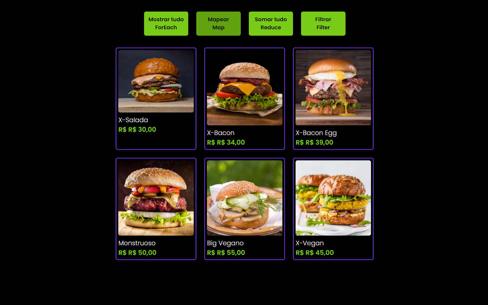

# Dev Burguer

Este repositório contém o projeto Dev Burguer que é um site 'cardápio' de hambúrgueres. O objetivo do projeto foi criar uma aplicação simples usando métodos de array´s como forEach, Map, Reduce e Filter, com a linguagem JavaScript, HTML e CSS.

🔗 [Click here to access](https://n4ju15.github.io/dev_burguer/)

## Para Desktop

## Para Mobile

## Tecnologias

- HTML
- CSS
- JavaScript
- Git and Github

